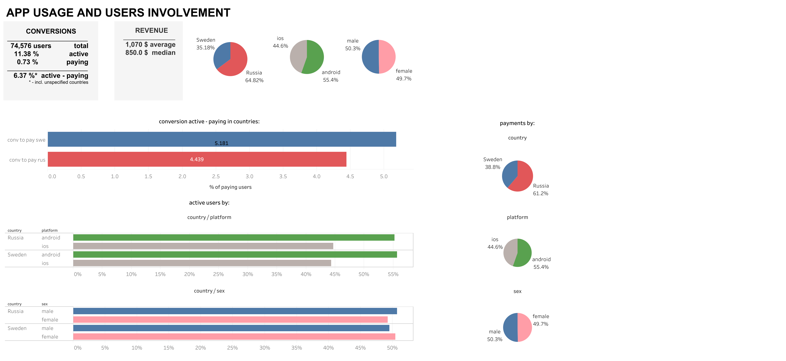

### Анализ результатов А/Б - тестирования для сервиса онлайн обработки фотографий

#### О проекте

В сервисе онлайн обработки и оформления фотографий в формате Stories (например, для дальнейшего  
экспорта в Instagram Stories) был проведен А/Б-тест: тестовой группе предлагалась новая модель оплаты  
коллекций шаблонов, контрольной – старая механика.

Работа выполнена в рамках финально проекта курса _Аналитик данных_ от _Karpov Courses_.

**Цели и задачи работы:**  

1) Проанализировать результаты А/Б-тестирования и определить нужно ли расскатывать новую  
модель на всех пользователей. Также было необходимо обосновать выбор метрик, на которые необходимо обращать 
внимание, и объяснить с чем могут быть связаны различия, если таковые имеются и являются ли эти различия значимыми;

2) Спроектировать дашборд отображающий использование приложения и вовлеченность пользователей

#### Данные

- active_users – информация о пользователях, которые посещали приложение во время эксперимента. 
- groups – разбивка пользователей на контрольную (А) и тестовую (В) группы. 
- purchases – данные о транзакциях (оплатах) пользователей приложения во время эксперимента 

#### Вывод по работе

Были протестированы гипотезы:

- О равенстве пропорций активных пользователей в группах
- О равенстве пропорций платящих пользователей (случаев оплат) в группах
- О равенстве средних и медианных сумм оплаты:
- О равенстве средних и медианных сумм оплаты между группами
- О равенстве средних и медианных платежей по платформам между группами
- О равенстве средних и медианных платежей по странам между группами
- О равенстве пропорций платящих пользователей:
- О равенстве пропорций платящих пользователей (случаев оплаты) по платформам между группами
- О равенстве пропорций платящих пользователей (случаев оплаты) по странам между группами

Переход к новой модели оплаты привел к повышению среднего и медианного платежей, а также повышению доли активных пользователей, т.е. увеличению интереса к продукту. Анализ повышений при разбивке по странам и платформам показал, что повышения происходят независимо от платформы и страны, т.е. это не связано со страной или платформой. Таким образом, наблюдается общий эффект повышения интереса и уровня платежей при переходе от старой модели оплаты к новой. Новую модель оплаты можно раскатать на всех пользователей.

#### Дашборд

Дашборд отображает вовлеченность пользователей и использование приложения

